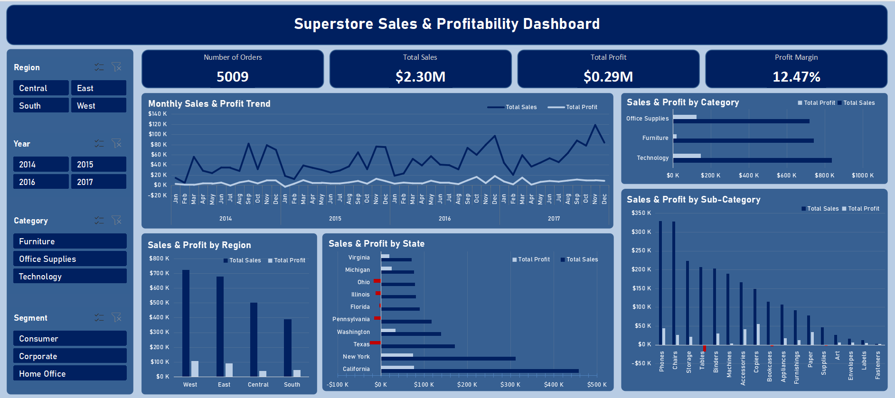

# Superstore Sales & Profitability Dashboard (Excel)

## 📊 Project Overview

This project presents an interactive Excel dashboard built using the Superstore dataset to analyze sales performance, profitability, and business trends across regions, categories, and time.

The goal of this project was not just to visualize data, but to identify key business problems and derive actionable insights using Excel as a data analysis tool.

---

## 🖥️ Dashboard Preview

---

## 🎯 Key Features

* Interactive dashboard using slicers (Region, Category, Year, Segment)
* KPI cards showing Total Sales, Total Profit, Number of Orders, and Profit Margin
* Monthly Sales & Profit trend analysis
* Region-level and State-level performance comparison
* Category and Sub-category profitability breakdown
* Highlighting of loss-making segments and products

---

## 🛠️ Tools & Techniques Used

* Microsoft Excel
* Pivot Tables & Pivot Charts
* Slicers for interactivity
* Data Cleaning & Feature Engineering
* Custom KPI calculations (Profit Margin, Loss Rate, etc.)
* Dashboard design using shapes and layout structuring

---

## 🔍 Key Insights

* Sales show a steady upward trend over time, but profit remains volatile.
* The Central region has significantly lower profit margins compared to other regions.
* The Furniture category generates high sales but very low or negative profit.
* Sub-categories like Tables and Bookcases are consistently loss-making.
* A large portion of revenue comes from discounted sales, negatively impacting profitability.

---

## 📁 Project Structure

* `data/` → Cleaned dataset used for analysis
* `dashboard/` → Final Excel dashboard file
* `images/` → Dashboard preview screenshot

---

## ▶️ How to Use

1. Download the Excel file from the `dashboard/` folder
2. Open the dashboard
3. Use slicers on the left to filter by Region, Category, Year, and Segment
4. Explore trends and insights interactively

---

## 💡 Conclusion

This project demonstrates how Excel can be used not just for reporting, but for building interactive dashboards and uncovering meaningful business insights. It highlights the importance of analyzing both revenue and profitability to make better business decisions.

---
